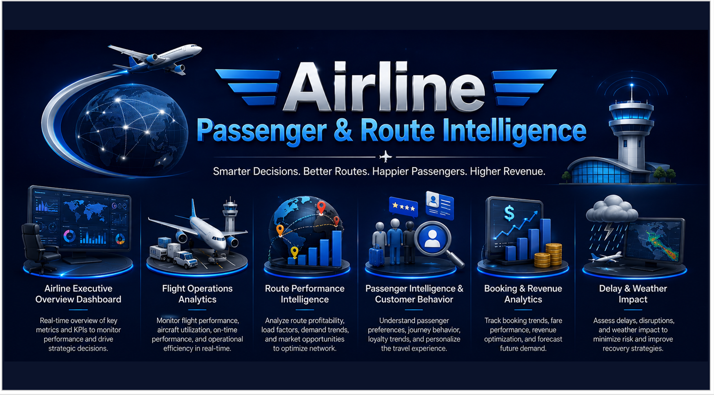
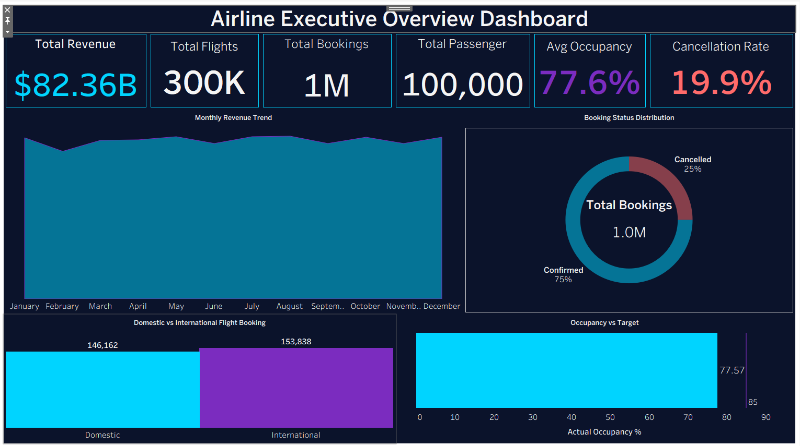
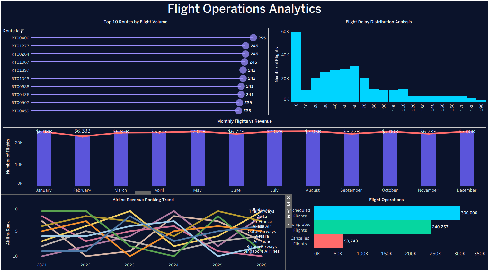
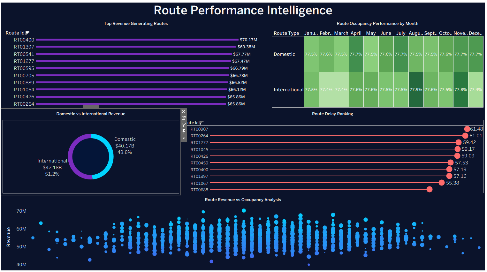
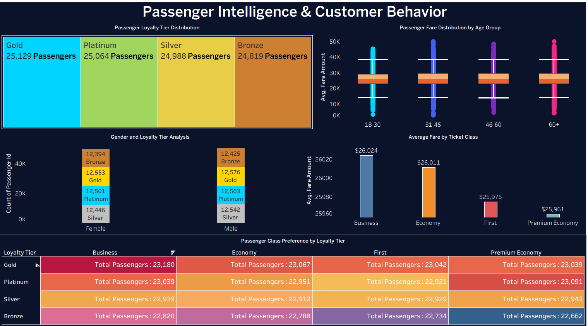
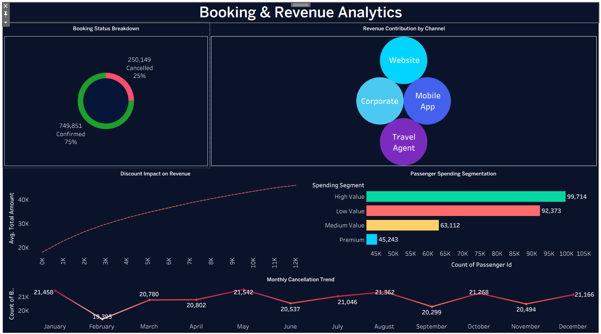
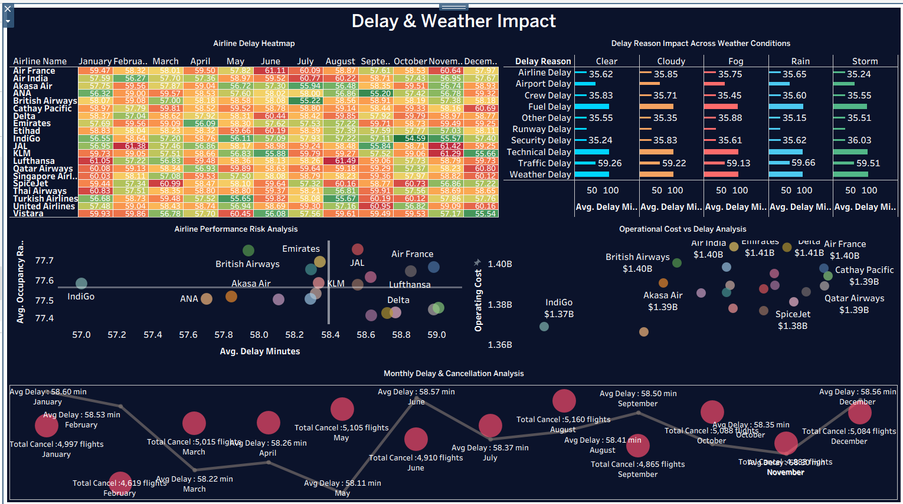

# ✈️ Airline Passenger & Route Intelligence Dashboard

A complete end-to-end Airline Analytics & Business Intelligence project focused on airline operations, route performance, passenger behavior, revenue intelligence, and delay impact analysis.

Built using:

# PostgreSQL → Data Warehouse → Gold Layer Dataset → Tableau Public

---

# 🔗 Live Dashboard

[View Dashboard](YOUR_TABLEAU_PUBLIC_LINK)

---

---

# 📌 Project Overview

This project is a complete Airline Passenger & Route Intelligence solution designed to analyze:

- Airline Operations
- Flight Performance
- Route Intelligence
- Passenger Behavior
- Revenue Performance
- Booking Analytics
- Delay & Weather Impact

The goal of this project was to build an enterprise-style airline analytics platform using PostgreSQL and Tableau.

---

# 🏗️ PostgreSQL Data Engineering Workflow

## Step 1 — Raw Data Ingestion

Raw airline datasets were imported into PostgreSQL.

The dataset contains:

- Flight Operations
- Passenger Information
- Route Information
- Airport Information
- Weather Information
- Booking Transactions
- Revenue Data

---

## Step 2 — Data Warehouse Design

### Dimension Tables

- dim_aircraft
- dim_airline
- dim_airport
- dim_booking_date
- dim_channel
- dim_city
- dim_country
- dim_date
- dim_delay_reason
- dim_passenger
- dim_region
- dim_route
- dim_state
- dim_ticket_class
- dim_time
- dim_weather

### Fact Tables

- fact_booking
- fact_flight_operations

---

## Step 3 — SQL Data Cleaning & Transformation

Data was cleaned and standardized inside PostgreSQL.

### Cleaning Activities

- Duplicate Removal
- Missing Value Handling
- Data Type Standardization
- Date Transformation
- Revenue Validation
- Delay Data Cleaning
- Passenger Data Standardization
- Route Data Validation

---

## Step 4 — Gold Layer Dataset Creation

A curated Gold Layer dataset was created from the PostgreSQL Data Warehouse.

### Features

- Business Ready Data
- Analytics Optimized Structure
- KPI Ready Design
- Reporting Friendly Dataset
- Tableau Optimized Model

The Gold Layer served as the final analytical source for Tableau dashboards.

---

## Step 5 — Final Architecture

### Raw Layer

- Source Airline Data

### Warehouse Layer

- Fact Tables
- Dimension Tables

### Gold Layer

- Analytical Dataset

### Visualization Layer

- Tableau Public Dashboards

---

# 🛠️ Tools & Technologies

| Tool | Purpose |
|--------|----------|
| PostgreSQL | Data Storage & Processing |
| SQL | Data Cleaning & Transformation |
| Data Warehouse | Star Schema Modeling |
| Gold Layer Dataset | Analytics Layer |
| Tableau Public | Dashboard Development |
| Data Modeling | Relationship Modeling |

---

# 📊 Dashboard Pages

---

# 🏠 Home Page

Interactive Navigation Hub

Provides quick navigation to all dashboard sections.

---

# 🟦 Page 1 — Airline Executive Overview Dashboard

### Focus Areas

- Revenue Monitoring
- Flight Performance
- Passenger Volume
- Occupancy Analysis
- Cancellation Tracking

### Visuals

- KPI Cards
- Revenue Trend Analysis
- Booking Status Distribution
- Domestic vs International Analysis
- Occupancy vs Target
- Executive Summary

---

# 🟪 Page 2 — Flight Operations Analytics

### Focus Areas

- Flight Performance
- Route Activity
- Delay Monitoring
- Airline Rankings
- Operational Performance

### Visuals

- Route Volume Analysis
- Flight Delay Distribution
- Monthly Flights vs Revenue
- Airline Ranking Trend
- Flight Operations Summary

---

# 🟦 Page 3 — Route Performance Intelligence

### Focus Areas

- Route Revenue
- Route Occupancy
- Route Profitability
- Route Delay Performance

### Visuals

- Top Revenue Routes
- Route Occupancy Heatmap
- Domestic vs International Revenue
- Route Delay Ranking
- Revenue vs Occupancy Analysis

---

# 🟪 Page 4 — Passenger Intelligence & Customer Behavior

### Focus Areas

- Passenger Segmentation
- Loyalty Program Analysis
- Fare Analysis
- Ticket Class Intelligence

### Visuals

- Loyalty Tier Distribution
- Fare Distribution by Age Group
- Gender vs Loyalty Analysis
- Average Fare by Ticket Class
- Passenger Class Preference Heatmap

---

# 🟦 Page 5 — Booking & Revenue Analytics

### Focus Areas

- Revenue Intelligence
- Booking Performance
- Channel Contribution
- Passenger Spending Behavior

### Visuals

- Booking Status Breakdown
- Revenue Contribution by Channel
- Discount Impact Analysis
- Passenger Spending Segmentation
- Monthly Cancellation Trend

---

# 🟪 Page 6 — Delay & Weather Impact

### Focus Areas

- Delay Monitoring
- Weather Impact
- Operational Risk
- Cost Analysis

### Visuals

- Airline Delay Heatmap
- Delay Reason Analysis
- Airline Risk Quadrant
- Operational Cost vs Delay
- Monthly Delay & Cancellation Analysis

---

# 📁 Dataset

Due to GitHub file size limitations, the complete dataset is not included in this repository.

🔗 Download Full Dataset:  
[Dataset Link Here]

> **Note:** Raw airline operational data was imported into PostgreSQL and modeled using a dimensional data warehouse architecture (Fact & Dimension tables). After data cleaning, transformation, and business-rule implementation, a curated Gold Layer dataset was created and exported for Tableau. This Gold dataset served as the primary analytical source for all dashboards, enabling airline operations analysis, route intelligence, passenger behavior insights, revenue analytics, booking performance monitoring, and delay impact assessment.

---

# 📸 Dashboard Preview

## Home Page

---

## Executive Overview

---

## Flight Operations Analytics

---

## Route Performance Intelligence

---

## Passenger Intelligence & Customer Behavior

---

## Booking & Revenue Analytics

---

## Delay & Weather Impact

---

# 🧠 Skills Demonstrated

- PostgreSQL
- SQL
- Data Warehousing
- Star Schema Modeling
- Data Cleaning
- Data Transformation
- Gold Layer Design
- Tableau Public
- Dashboard Development
- KPI Design
- Business Intelligence
- Airline Analytics
- Revenue Analytics
- Passenger Analytics
- Operational Analytics

---

# ✅ Project Outcome

This project demonstrates an enterprise-grade Airline Analytics Platform capable of:

- Monitoring Airline Performance
- Analyzing Passenger Behavior
- Evaluating Route Profitability
- Tracking Revenue Performance
- Measuring Delay Impact
- Supporting Executive Decision-Making
- Delivering Interactive Business Intelligence Insights

---

# 👨‍💻 About Me

## Sayan Naha

📧 Email: snsayan2012@gmail.com

🔗 LinkedIn: https://www.linkedin.com/in/sayan-naha/
